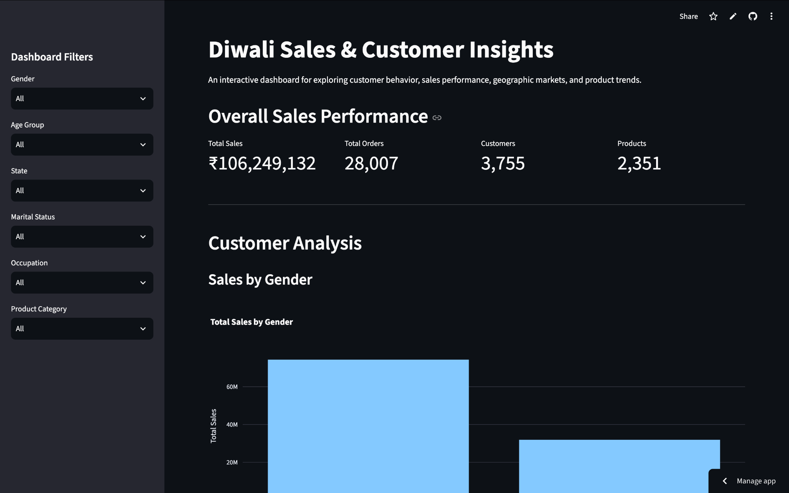

# Diwali Sales & Customer Insights



An interactive sales analytics dashboard built using Python, Pandas, Plotly, and Streamlit.

## Project Overview

This project analyzes Diwali sales data to understand customer purchasing behavior, sales performance, geographic markets, and product trends.

The analysis was performed using a Jupyter Notebook, and the insights were transformed into an interactive Streamlit dashboard.

## Features

- Overall sales and order KPIs
- Gender-wise sales analysis
- Age-group sales analysis
- State-wise sales analysis
- Marital-status analysis
- Occupation-wise sales analysis
- Product-category analysis
- Top product analysis
- Interactive dashboard filters
- Business insights
- Filtered dataset download

## Technologies Used

- Python
- Pandas
- NumPy
- Matplotlib
- Seaborn
- Plotly
- Streamlit
- Jupyter Notebook

## Project Structure

```text
Diwali Sales Project/
│
├── app.py
├── Diwali Sales Data.csv
├── Diwali_Sales_Customer_Insights.ipynb
├── requirements.txt
└── README.md